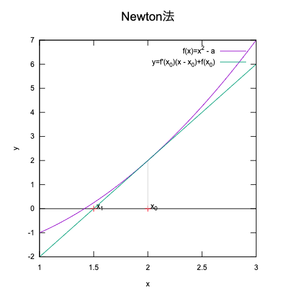
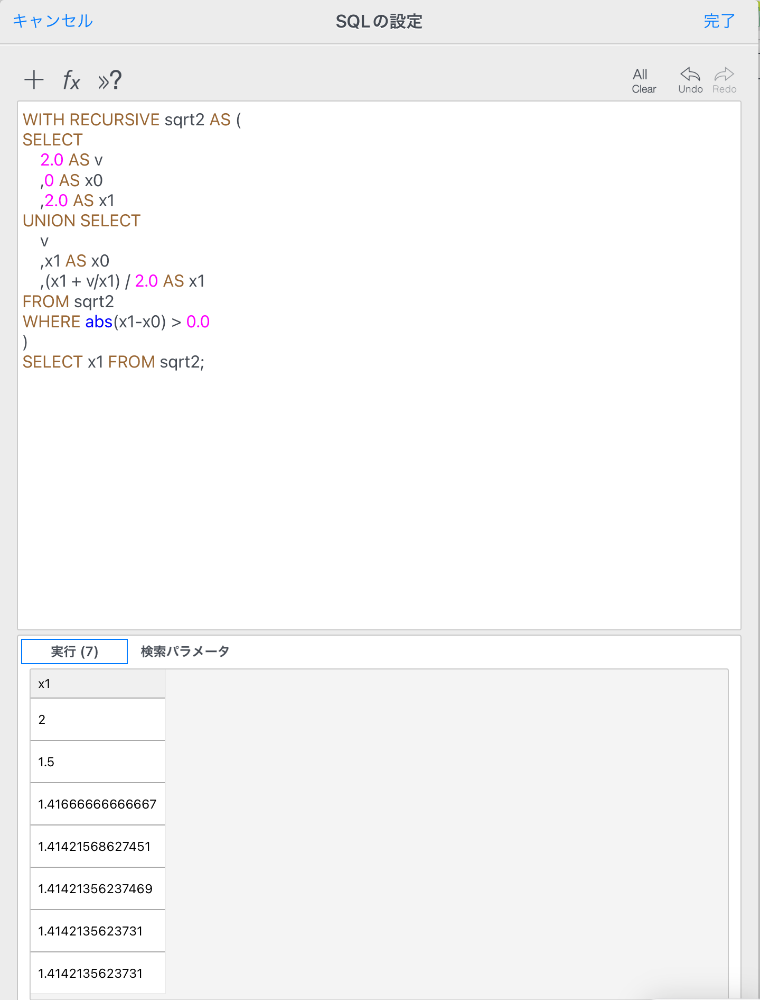
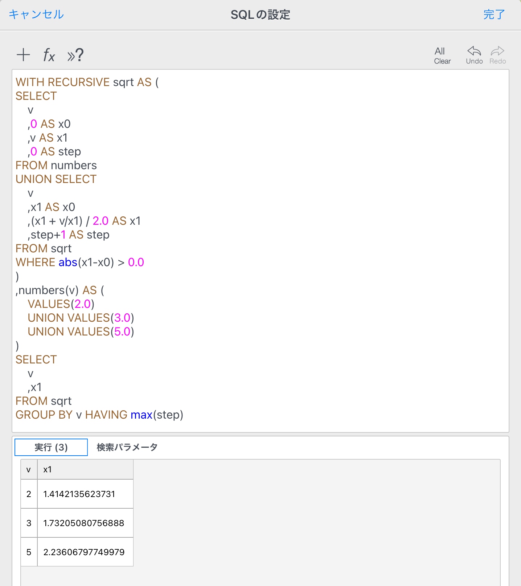

<!--
<script type="text/x-mathjax-config">MathJax.Hub.Config({tex2jax:{inlineMath:[['\$','\$'],['\\(','\\)']],processEscapes:true},CommonHTML: {matchFontHeight:false}});</script>
<script type="text/javascript" async src="https://cdnjs.cloudflare.com/ajax/libs/mathjax/2.7.1/MathJax.js?config=TeX-MML-AM_CHTML"></script>
-->

# SQLの再帰計算で平方根を求める

 `SQLite`には算術関数が用意されており、平方根を求める `SQRT` も用意されている。ただし、`SQLITE_ENABLE_MATH_FUNCTIONS` を有効にしてコンパイルした実行系に限られる。

ある時、算術関数が使えない環境で平方根を求める必要があり、`SQL` で平方根を求める方法を考えた。

## そもそも平方根の計算方法は？

コンピューターではニュートン法から得られる漸化式を再帰的に計算して平方根を計算する事ができる。
  

ある正の実数 $a$ について次の関数を考える。
$$f(x) = x^2-a$$
求めたい値は、 $f(x)=0$ となる $x$ ( $x > 0$ ) である。近似解 $x_k$ での接線  
$$y = f'(x_k) (x-x_k) + f(x_k)$$
と $x$ 軸の交点の $x$ 座標を $x_{k+1}$ とすると、
$$x_{k+1} = x_k - \frac{f(x_k)}{f'(x_k)}= x_k - \frac{x_k^2-a}{2x_k}= \frac{1}{2} (x_k + \frac{a}{x_k})$$  
である。これを繰り返し計算( $k \to \infty$ )[^1]することで、 $f(x)=0$ となる $x$ を近似的に求めることができる。

[^1]: 実際には、$x_{k+1} - x_k$ が 十分小さくなるまで繰り返す。

漸化式がわかったので、あとは `SQL` で再帰計算して収束した値をとればよい。

## SQLの再帰計算

### 確認

まず再帰計算のやり方について簡単に見ておこう。
`WITH RECURSIVE` で 再帰的共通テーブル式を複合`SELECT`文で定義する。

複合`SELECT`文は初期値の`SELECT` とそれに`UNION (ALL)`で続く再帰SELECTからなる

例として、1から5までの数値を生成する`SQL`を示す。

``` sql
WITH RECURSIVE cnt AS (
    SELECT 1 AS n  -- 初期値
    UNION SELECT n+1 AS n FROM cnt WHERE n < 5 -- cnt テーブル自身を参照して新しいレコードを追加する
)
SELECT n FROM cnt; -- cnt から n を取り出す
```

実行結果は次のようになる。

|n|
|-|
|1|
|2|
|3|
|4|
|5|

処理の流れについては[公式ドキュメント](https://www.sqlite.org/lang_with.html#recursivecte
)を参照。

### 平方根の計算

漸化式と再帰計算を使って2の平方根を計算してみよう。

``` sql
WITH RECURSIVE sqrt2 AS (
SELECT
    2.0 AS v    -- 平方根を計算したい数値
    ,0 AS x0    -- xn
    ,2.0 AS x1  -- xn+1
UNION SELECT -- sqrt テーブル自身を参照して新しいレコードを追加する
    v
    ,x1 AS x0   -- 前回の計算結果
    ,(x1 + v / x1) / 2.0 AS x1 -- 漸化式から次の結果計算
FROM sqrt2
WHERE abs(x1 - x0) > 0.0
)    
SELECT x1 FROM sqrt2;
```

実行結果は次の様になる。


2 からスタートして 1.4142135623731 に収束している。

汎用的には、計算したい数値を別のテーブルから取得するようにしておけば良いだろう。
ここでは、`WITH`句の中で `numbers` テーブルとして定義しておく。

```sql
WITH RECURSIVE sqrt AS (
SELECT
    v    -- 平方根を計算したい数値
    ,0 AS x0    -- xn
    ,v AS x1  -- xn+1
    ,0 AS step -- ステップ数
FROM numbers
UNION SELECT -- sqrt テーブル自身を参照して新しいレコードを追加する
    v
    ,x1 AS x0   -- 前回の計算結果
    ,(x1 + v / x1) / 2.0 AS x1 -- 漸化式から次の結果計算
    ,step + 1 AS step -- 計算ごとにステップ数を上げる
FROM sqrt
WHERE abs(x1 - x0) > 0.0
)
,numbers(v) AS (
VALUES (2.0)
UNION VALUES(3.0)
UNION VALUES(5.0)
)
SELECT 
    v
    ,x1
FROM sqrt
GROUP BY v -- 計算する数値でグループ化
HAVING max(step); -- ステップ数が最大のものを取り出す
```

2, 3, 5 の平方根が得られる。


## まとめ

`SQL` で再帰計算を行う例として平方根を求めた。次のステップでは`表`に入力された数値に対して平方根を求めた結果を`表`に書き戻す様にしてみよう。

## 参考文献

* https://www.sqlite.org/lang_with.html#recursivecte

---
